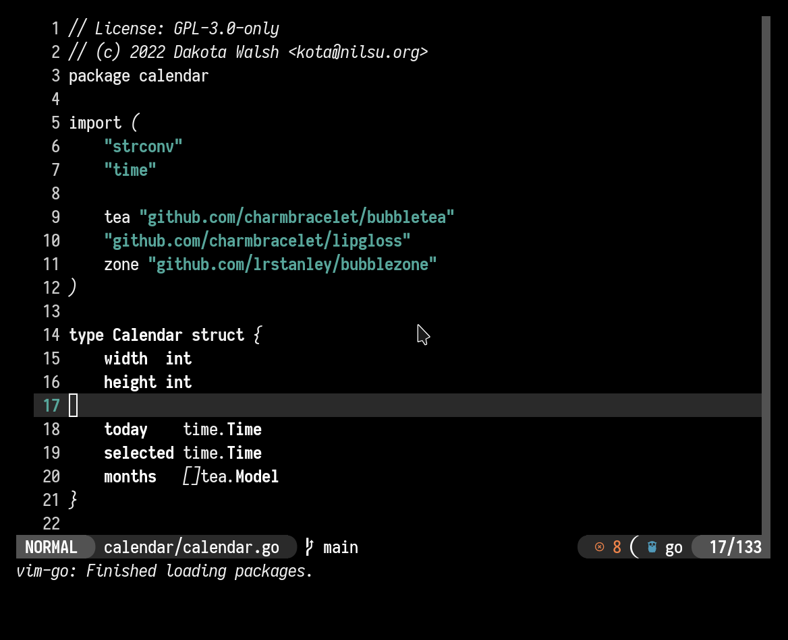

# far-left
A minimal lua colorscheme for neovim.

## Screenshots



## Usage
Install the theme with your favorite package manager (or lack thereof):
```lua
use 'https://git.sr.ht/~kota/far-left'
```

Run setup:
```lua
local left = require('far-left')
left.setup()
```

Using the lualine theme:
```lua
local left_theme = left.lualine()
require('lualine').setup {
	options = {
		theme = left_theme,
```

## License
GPL3 - See License for details.

Copyright 2022 Dakota Walsh
